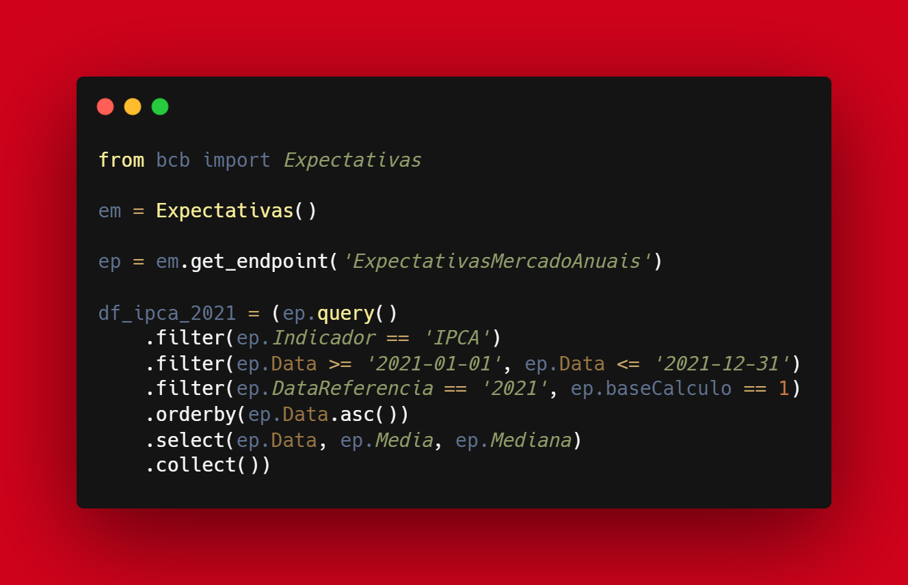

```{r setup, include=FALSE}
knitr::opts_chunk$set(echo = FALSE)
```

Obter os dados para análise de forma simples é fundamental e necessário.

Depois de passar alguns anos mantendo o pacote {rbcb} que faz a integração do R com as APIs de dados abertos do Banco Central, decidi fazer o port para Python.

Em parte porque o PyPI (Python Package Index - repositório de pacotes do Python) é bem menos burocrático que o CRAN (repositório de pacote do R), mas nos últimos anos tenho mexido mais com Python e fazia sentido portar algumas ferramentas.

O pacote {python-bcb} é a contraparte em Python do pacote {rbcb} do R.

Só que acabou ficando maior, não por causa do Python, mas por que eu estava com tempo e paciência e acabei implementando parte da especificação OData. Isso permite de forma bem simples integrar diversas APIs do Banco Central que implementam essa especificação. Na minha última contagem tinha 39 APIs nessa estrutura.

O pacote {python-bcb} traz as seguintes APIs:

- SGS
- Séries de Moedas do Conversor de Moedas do Banco Central
- Expectativas do FOCUS
- Boletins da PTAX (abertura, 3 intradiários, fechamento)
- Dados selecionados de instituições financeiras (IFDATA)

Agora o que dá mais trabalho ao fazer a integração de uma API é escrever a documentação😉 dado que as APIs não são padronizadas.

Vou comunicando aqui na medida que novas APIs forem sendo integradas.

Obviamente espero todo o tipo de comentários e sugestões.

Documentação do projeto: https://wilsonfreitas.github.io/python-bcb/index.html

Link do projeto: https://github.com/wilsonfreitas/python-bcb

Na imagem segue um exemplo que como utilizar a API de Expectativas do FOCUS para obter um DataFrame das expectativas de IPCA de 2021 ao longo de 2021.

