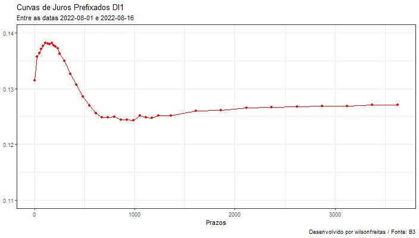

```{r setup, include=FALSE}
knitr::opts_chunk$set(echo = TRUE)
```

A reunião do COPOM de 3 de agosto trouxe uma mudança na estrutura da curva de juros,
tanto para a parte curta como para a parte longa.
A interpretação do comunicado por agentes de mercado é de o ciclo de alta de juros está
próximo do fim.

Na prática a dinâmica da parte longa da curva de juros foi bastante afetada.
Aqui apresento uma animação onde observa-se o movimento da curva de juros nas duas primeiras
semanas do mês de agosto de 2022.
A reunião do COPOM aconteceu em 3 de agosto.
Fica claro pela animação a mudança nas expectativas de longo prazo para a curva.

Vamos utilizar o 📦 {rb3} para obter as curvas e o 📦 {fixedincome} na construção dos gráficos
da estrutura a termo de juros.
A animação é construida com o 📦 {animation}.

```{r load}
library(fixedincome)
library(rb3)
library(bizdays)
library(dplyr)
library(ggplot2)

get_di1_curve <- function(refdate) {
  fut <- futures_get(refdate)
  yc <- yc_get(refdate)
  df <- yc_superset(yc, fut)

  df_curve <- bind_rows(
    df |> slice(1) |> select(biz_days, r_252),
    df |> filter(!is.na(symbol)) |> select(biz_days, r_252)
  ) |>
    filter(!duplicated(biz_days))

  spotratecurve(
    df_curve$r_252, df_curve$biz_days, "discrete", "business/252", "Brazil/ANBIMA",
    refdate = refdate
  )
}
```

Vamos obter as curvas para os dias úteis entre 2022-08-01 e 2022-08-16 e colocá-las em uma lista.
Na sequência a animação será construída com cada uma das curvas da lista, sendo que a primeira curva
tem a cor vermelha e a última tem cor azul, as demais curvas são em cinza.
O objetivo é acompanhar a evolução das curvas tendo em destaque o começo e fim.

```{r}
dates <- bizseq("2022-08-01", "2022-08-16", "Brazil/ANBIMA")
curves <- lapply(seq_along(dates), function(ix) get_di1_curve(dates[ix]))

anim <- animation::saveGIF(
  {
    g <- autoplot(curves[[1]], curve.x.axis = "terms", colour = "red") +
      autolayer(curves[[1]], curve.geom = "point", curve.x.axis = "terms", colour = "red") +
      ylim(0.11, 0.14) +
      theme_bw() +
      theme(legend.position = "none") +
      labs(
        x = "Prazos", y = NULL, title = "Curvas de Juros Prefixados DI1",
        subtitle = "Entre as datas 2022-08-01 e 2022-08-16",
        caption = "Desenvolvido por wilsonfreitas / Fonte: B3"
      )
    print(g)

    for(curve in curves[-c(1, length(curves))]) {
      g <- g + autolayer(curve, curve.x.axis = "terms", colour = "grey") +
        autolayer(curve,
          curve.geom = "point", curve.x.axis = "terms", colour = "grey"
        )
      print(g)
    }

    g <- g + autolayer(curves[[length(curves)]], curve.x.axis = "terms", colour = "blue") +
      autolayer(curves[[length(curves)]],
        curve.geom = "point", curve.x.axis = "terms", colour = "blue"
      )
    print(g)
  },
  interval = 0.8,
  ani.height = 400,
  ani.width = 704
)
```


