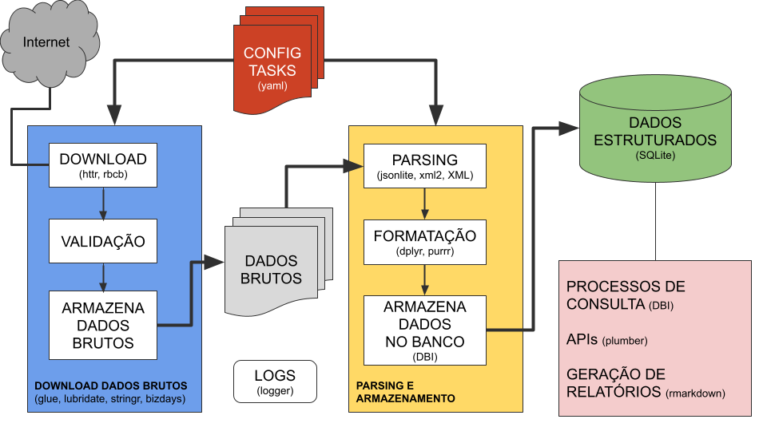

```{r setup, include=FALSE}
knitr::opts_chunk$set(echo = FALSE)
```

<!-- coleta de dados -->

[Link para o curso](https://p.eduzz.com/996977)

Construir um banco de dados financeiros com um processo 100% automático desenvolvido na linguagem R.

Esta é a proposta desse curso!

Quem faz análises com dados financeiros sofre com informações espalhadas em diversos lugares, em
formatos distintos e atualizadas em momentos diferentes.

A construção de um repositório único, onde as informações são padronizadas e podem ser acessadas
de maneira simples em um banco de dados único.

O curso **Construindo Banco de Dados Financeiros** tem uma abordagem 100% mão na massa para a
construção de um banco de dados a partir da coleta automatizada de diversos dados do mercado
financeiro.

Os dados são referentes a diversos contratos negociados no mercado e indicadores financeiros
necessários para tarefas apreçamento e cálculo de risco.

Todo o conteúdo do curso é totalmente desenvolvido com a linguagem de programação e análise de dados
R.
Passa por diversos pacotes para processamento de dados, leitura de arquivos: texto, json, csv, xml,
operações em banco de dados relacional e consumo de APIs on-line.

O objetivo é construir um sistema *DO ZERO* para automatizar o processo de download de dados
financeiros de diversas fontes do mercado financeiro (B3, ANBIMA, BACEN, TesouroDireto), criando
um repositório de dados para o processamento e o enriquecimento dos dados para que sejam usados
em diversas análises.

Serão desenvolvidos os processos de download e armazenamento dos dados brutos e, posteriormente,
o processo de enriquecimento que transforma os dados brutos em dados estruturados.

No fim, serão criadas funções no R para consumir os dados estruturados e utilizá-los nas mais
diversas análises.

```{r, echo=FALSE}
df <- readxl::read_excel("data/dldf.xlsx")
```

```{r echo=FALSE}
total_duration <- df |>
  summarize(total_duration = hms(
    seconds = as.integer(sum(duration) / 1000) %% 60,
    minutes = as.integer(sum(duration) / (1000 * 60)) %% 60,
    hours = as.integer(sum(duration) / (60 * 60 * 1000))
  )) |>
  pull(total_duration)
```

**Duração**: `r total_duration`


## Módulo 1: Processo de Downloads e Tratamento de Dados



Desenvolvemos um processo totalmente em R onde o usuário pode, através de
arquivos de configuração YAML, definir os dados que serão baixados e incluídos
no banco de dados.

O fato do código ser 100% R permite que, com o passar das aulas, o aluno
compreenda cada passo do processo e seja capaz de realizar suas eventuais
intervenções.

```{r echo=FALSE}
total_duration <- df |>
  filter(section == 1) |>
  summarize(total_duration = hms(
    seconds = as.integer(sum(duration) / 1000) %% 60,
    minutes = as.integer(sum(duration) / (1000 * 60)) %% 60,
    hours = as.integer(sum(duration) / (60 * 60 * 1000))
  )) |>
  pull(total_duration)
```

**Duração**: `r total_duration`

```{r}
df |>
  filter(section == 1) |>
  select(order, title, time) |>
  mutate(time = format(time, "%M:%S")) |>
  rename(`#` = order, Aula = title, `Duração` = time) |>
  knitr::kable()
```

### Download e processamento da Taxa DI (CDI) e do Índice DI (IDI) da B3

A Taxa DI é uma das taxa de juros mais importantes utilizadas no Brasil.
É a taxa de juros utilizada em diversos contratos negociados no mercado
financeiro, como CDBs, Debêntures, LCI, LCA e outros.

## Módulo 2: Banco para Armazenamento dos Dados (Mini Tutorial de SQL)

Vamos criar um banco de dados SQLite do zero para o armazenamento dos dados baixados.

Mini tutorial de SQL e operações CRUD (Create Read Update Delete)

```{r echo=FALSE}
total_duration <- df |>
  filter(section == 2) |>
  summarize(total_duration = hms(
    seconds = as.integer(sum(duration) / 1000) %% 60,
    minutes = as.integer(sum(duration) / (1000 * 60)) %% 60,
    hours = as.integer(sum(duration) / (60 * 60 * 1000))
  )) |>
  pull(total_duration)
```

**Duração**: `r total_duration`

```{r}
df |>
  filter(section == 2) |>
  select(order, title, time) |>
  mutate(time = format(time, "%M:%S")) |>
  rename(`#` = order, Aula = title, `Duração` = time) |>
  knitr::kable()
```

## Módulo 3: Indicadores Financeiros do Banco Central

Download e processamento de Indicadores Financeiros do Banco Central: IPCA, IGP-M, SELIC e Moedas

Processamento para geração do Número Índice dos indicadores financeiros: SELIC, IPCA, IGP-M

```{r echo=FALSE}
total_duration <- df |>
  filter(section == 3) |>
  summarize(total_duration = hms(
    seconds = as.integer(sum(duration) / 1000) %% 60,
    minutes = as.integer(sum(duration) / (1000 * 60)) %% 60,
    hours = as.integer(sum(duration) / (60 * 60 * 1000))
  )) |>
  pull(total_duration)
```

**Duração**: `r total_duration`

```{r}
df |>
  filter(section == 3) |>
  select(order, title, time) |>
  mutate(time = format(time, "%M:%S")) |>
  rename(`#` = order, Aula = title, `Duração` = time) |>
  knitr::kable()
```

## Módulo 4: Indicadores Financeiros da ANBIMA

Projeções de Inflação (IGP-M e IPCA) da ANBIMA VNA de Títulos Públicos da ANBIMA Preços e Taxas Títulos Públicos da ANBIMA

```{r echo=FALSE}
total_duration <- df |>
  filter(section == 4) |>
  summarize(total_duration = hms(
    seconds = as.integer(sum(duration) / 1000) %% 60,
    minutes = as.integer(sum(duration) / (1000 * 60)) %% 60,
    hours = as.integer(sum(duration) / (60 * 60 * 1000))
  )) |>
  pull(total_duration)
```

**Duração**: `r total_duration`

```{r}
df |>
  filter(section == 4) |>
  select(order, title, time) |>
  mutate(time = format(time, "%M:%S")) |>
  rename(`#` = order, Aula = title, `Duração` = time) |>
  knitr::kable()
```

## Módulo 5: Cadastro de Instrumentos da B3

Download e processamento do arquivo de Cadastro de Instrumentos (dados cadastrais de instrumentos) da B3 para Ações e Futuros

```{r echo=FALSE}
total_duration <- df |>
  filter(section == 5) |>
  summarize(total_duration = hms(
    seconds = as.integer(sum(duration) / 1000) %% 60,
    minutes = as.integer(sum(duration) / (1000 * 60)) %% 60,
    hours = as.integer(sum(duration) / (60 * 60 * 1000))
  )) |>
  pull(total_duration)
```

**Duração**: `r total_duration`

```{r}
df |>
  filter(section == 5) |>
  select(order, title, time) |>
  mutate(time = format(time, "%M:%S")) |>
  rename(`#` = order, Aula = title, `Duração` = time) |>
  knitr::kable()
```

## Módulo 6: Boletim de Negociação da B3

Download e processamento do arquivo Boletim de Negociação da B3 (Dados diários) para Ações e Futuros

```{r echo=FALSE}
total_duration <- df |>
  filter(section == 6) |>
  summarize(total_duration = hms(
    seconds = as.integer(sum(duration) / 1000) %% 60,
    minutes = as.integer(sum(duration) / (1000 * 60)) %% 60,
    hours = as.integer(sum(duration) / (60 * 60 * 1000))
  )) |>
  pull(total_duration)
```

**Duração**: `r total_duration`

```{r}
df |>
  filter(section == 6) |>
  select(order, title, time) |>
  mutate(time = format(time, "%M:%S")) |>
  rename(`#` = order, Aula = title, `Duração` = time) |>
  knitr::kable()
```

## Módulo 7: Cálculo do Preço Ajustado de Ações

Ajuste de retornos de Ações devido aos eventos corporativos (desdobramento, grupamento, etc)

```{r echo=FALSE}
total_duration <- df |>
  filter(section == 7) |>
  summarize(total_duration = hms(
    seconds = as.integer(sum(duration) / 1000) %% 60,
    minutes = as.integer(sum(duration) / (1000 * 60)) %% 60,
    hours = as.integer(sum(duration) / (60 * 60 * 1000))
  )) |>
  pull(total_duration)
```

**Duração**: `r total_duration`

```{r}
df |>
  filter(section == 7) |>
  select(order, title, time) |>
  mutate(time = format(time, "%M:%S")) |>
  rename(`#` = order, Aula = title, `Duração` = time) |>
  knitr::kable()
```

## Módulo 8: Curvas de Juros

Processamento para geração da Curva de Juros PrefixadaDownload e processamento das Curvas da ANBIMA

```{r echo=FALSE}
total_duration <- df |>
  filter(section == 8) |>
  summarize(total_duration = hms(
    seconds = as.integer(sum(duration) / 1000) %% 60,
    minutes = as.integer(sum(duration) / (1000 * 60)) %% 60,
    hours = as.integer(sum(duration) / (60 * 60 * 1000))
  )) |>
  pull(total_duration)
```

**Duração**: `r total_duration`

```{r}
df |>
  filter(section == 8) |>
  select(order, title, time) |>
  mutate(time = format(time, "%M:%S")) |>
  rename(`#` = order, Aula = title, `Duração` = time) |>
  knitr::kable()
```
