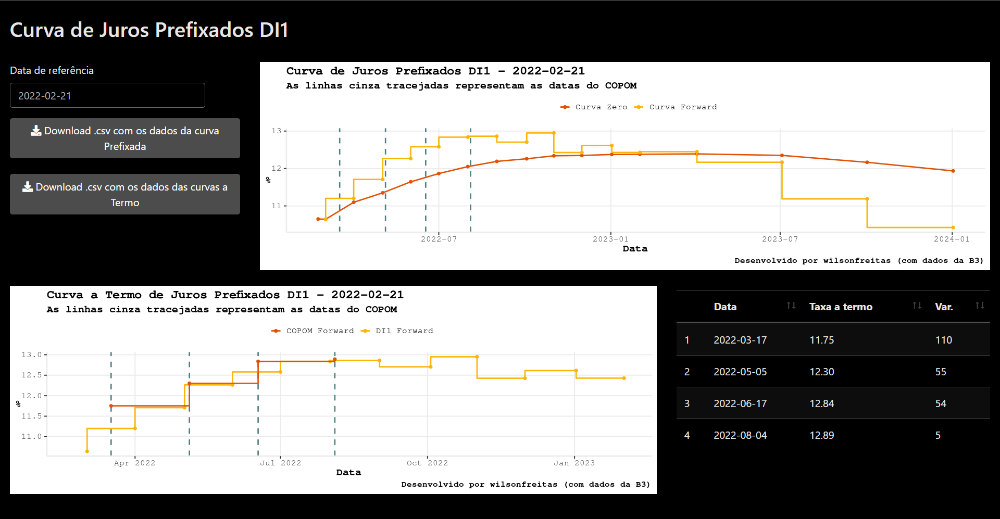

```{r setup, include=FALSE}
knitr::opts_chunk$set(echo = FALSE)
```

## Curva Pré

[curvapre]: https://wilsonfreitas.shinyapps.io/curvapre/

Shinyapp para visualização da curva de juros prefixados extraída dos contratos
futuros de taxa DI (DI1).

- [Link][curvapre]

Avalia-se:

- Curva de Juros Prefixados com um horizonte de 2 anos para uma data específica
    - Taxas de juros a termo entre os vértices da curva
- Expectativas de taxas de juros nas reuniões do COPOM
- Curva de Juros Prefixados completa + taxas de juros a termo + datas de reuniões do COPOM



