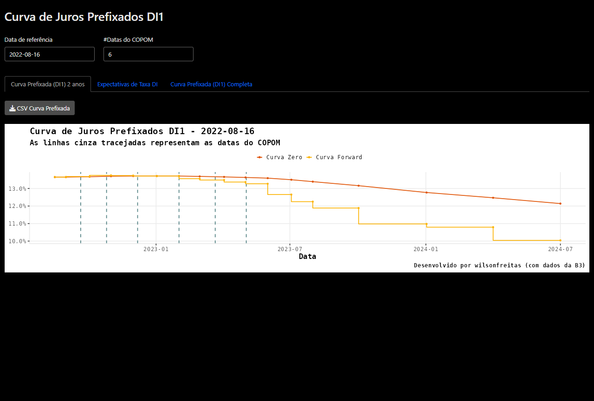
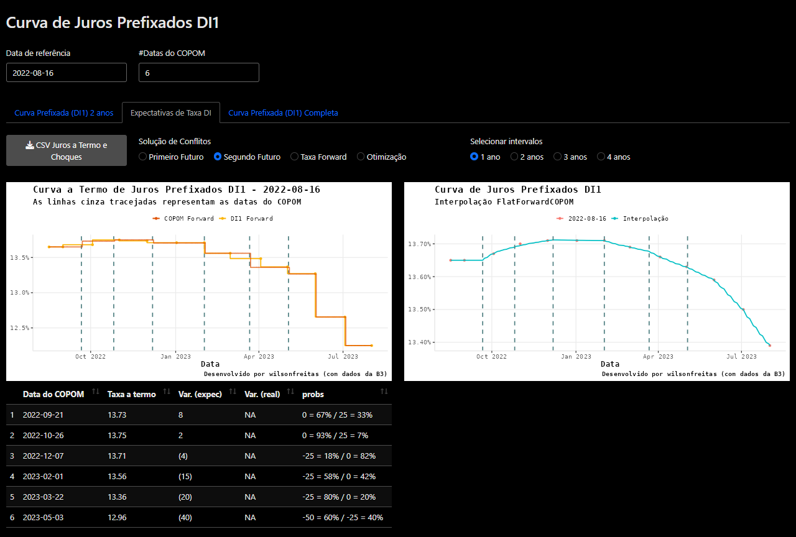
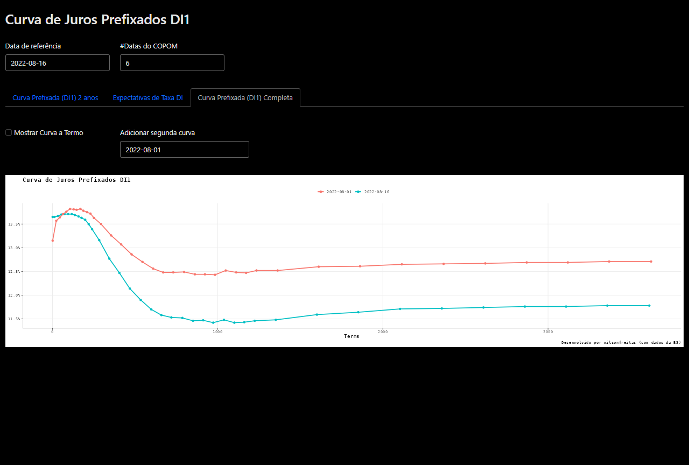
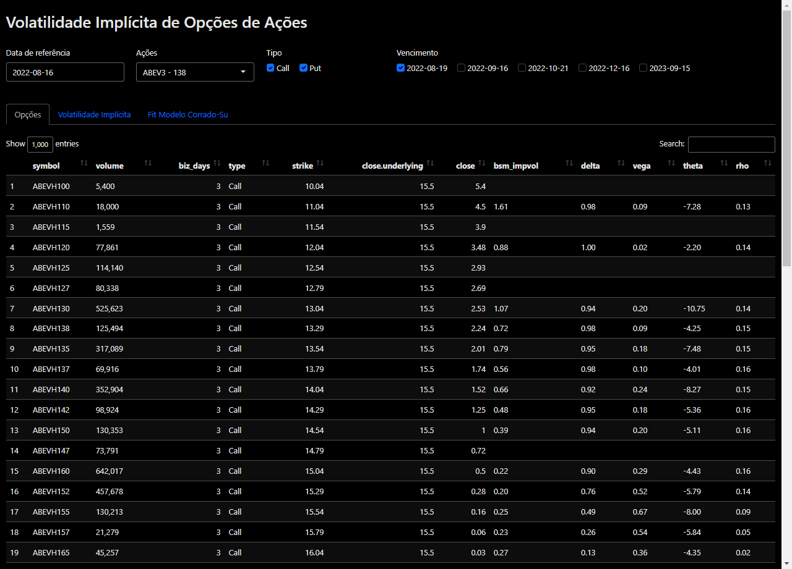
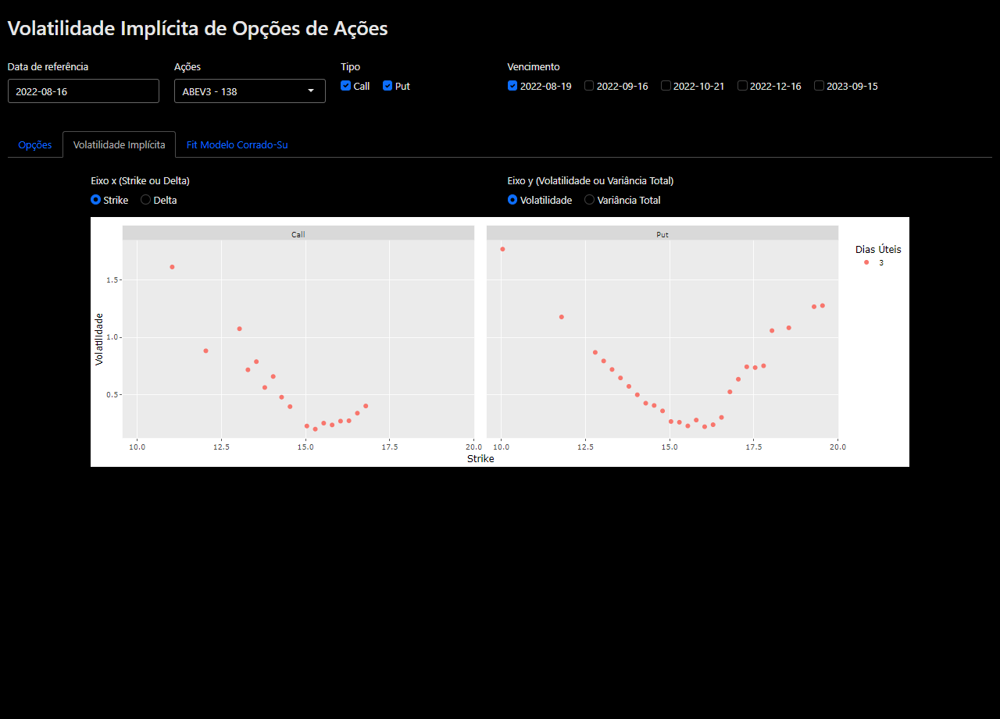
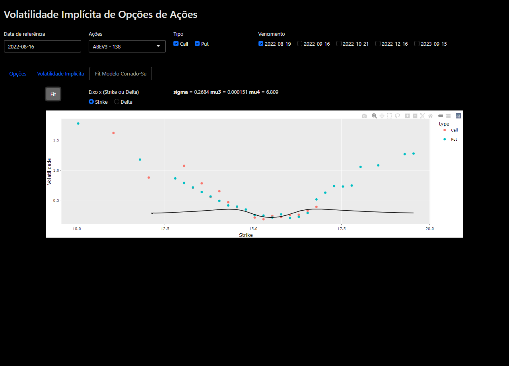
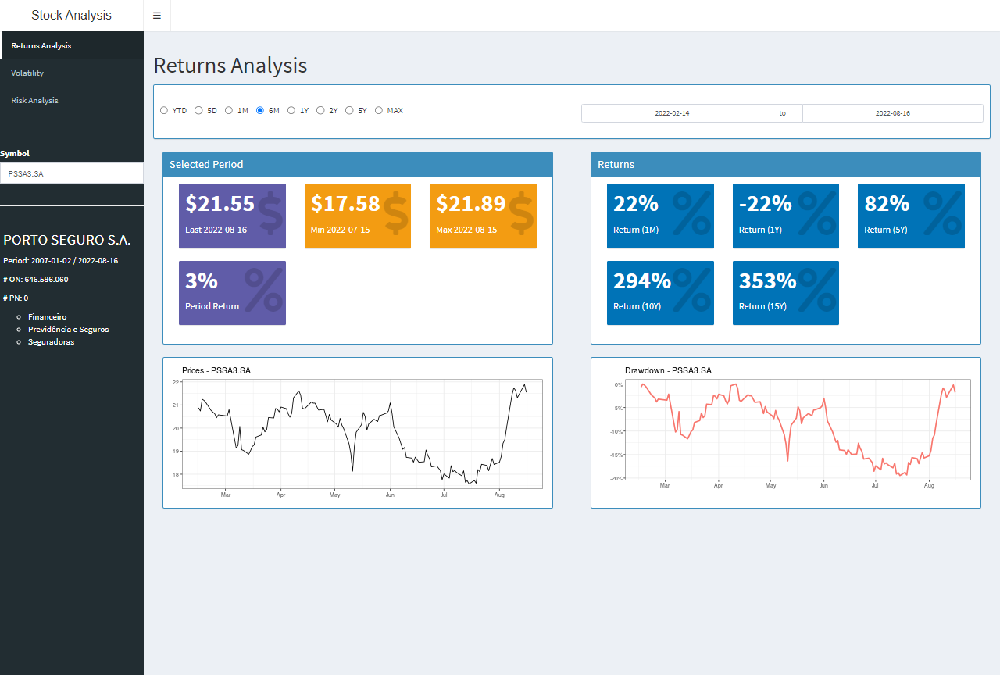
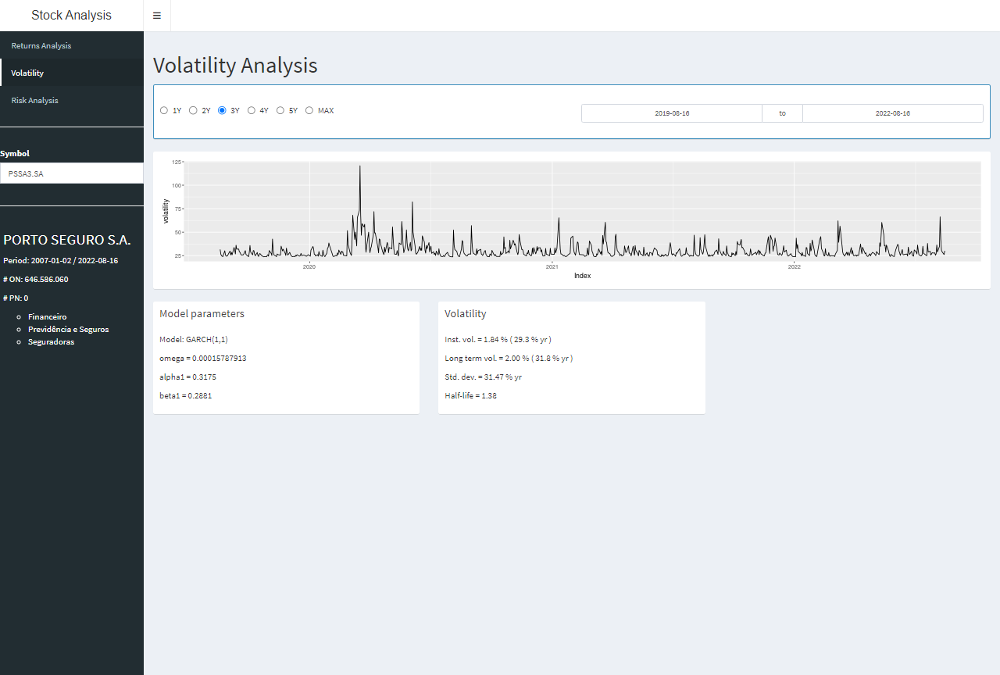
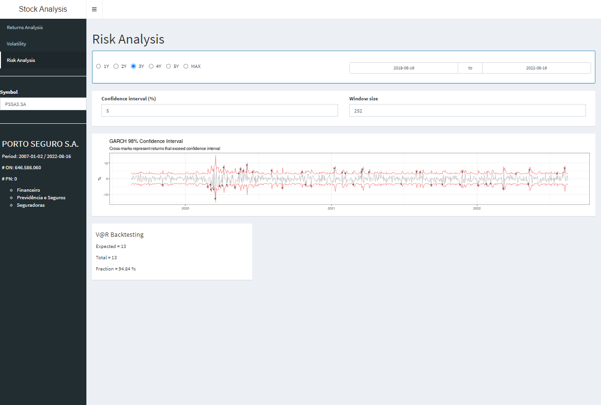

```{r setup, include=FALSE}
knitr::opts_chunk$set(echo = FALSE)
```

## Curva Pré

[curvapre]: https://wilsonfreitas.shinyapps.io/curvapre/

Shinyapp para visualização da curva de juros prefixados extraída dos contratos
futuros de taxa DI (DI1).

- [Link][curvapre]

Avalia-se:

- Curva de Juros Prefixados com um horizonte de 2 anos para uma data específica
    - Taxas de juros a termo entre os vértices da curva
- Expectativas de taxas de juros nas reuniões do COPOM
- Comparação de Curva de Juros Prefixados em diferentes datas







## OpApp

[OpApp]: https://wilsonfreitas.shinyapps.io/OpApp/

Shinyapp para visualização de dados de opções de ações.

- [Link][OpApp]

Avalia-se:

- Dados de opções de ações, volatilidade implícita e gregas
- Gráfico de Volatilidade Implícita
- Ajuste do modelo de Corrado-Su para os preços de opções e visualização das volatilidades pelo modelo







## Stock Analysis

[stock-analysis]: https://wilsonfreitas.shinyapps.io/stock-analysis/

Shinyapp para análise de ações com informações de retornos, volatilidade e análise de risco.

- [Link][stock-analysis]

Avalia-se:

- Retornos de uma ação para diversas janelas de tempo
    - Drawdown
- Volatilidade de uma ação com o modelo GARCH(1,1)
- Análise de Risco






